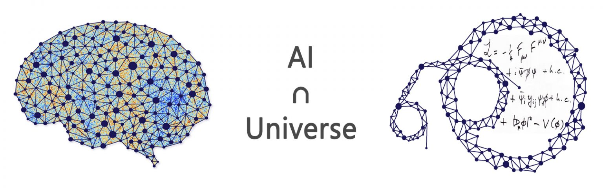

# Selección de Modelo de Machine Learning para predecir la Energía Potencial de Nanopartículas Metálicas a partir de sus características estructurales: 🌕🌟🌕

 

---

## The Bridge | Digital Talent Accelerator Bootcamp Data Science

## Machine Learning Project (*Proyecto Fin de Bootcamp*)

###  Josefina Cresta

#### Septiembre 2022

---

# Introducción

---
Los nanomateriales tienen restricciones de tamaño finito y descriptores morfológicos relacionados con la configuración o la forma (como las moléculas), pero también composiciones variables, descriptores cristalográficos y defectos (como los materiales). En el [análisis exploratorio de datos](https://github.com/JosefinaCresta/EDA_NanoparticulasAu_TBDS) realizado anteriormente, se estudiaron de manera estadística algunas de estas tantas características de las nanopartículas, se concluyó su relación con la energía de las mismas y se halló el valor físicamente importante de la energía potencial media por átomo, para nanopartículas de entre 236  y 14277  átomos. Pero la gran mayoría de los nanomateriales no pueden monodispersarse perfectamente y presentan millones de configuraciones posibles que modifican la energía potencial de la nanopartícula. Por lo que cada una tendrá un valor específico energía potencial. 

Esto representa un desafío único que con métodos de machine learning es posible resolver, teniendo en cuenta mayor cantidad de características descriptivas de las nanopartículas. Entonces la intención del presente trabajo es la selección de él o los mejores modelos de aprendizaje automático capaces de predecir la energía de cada nanoestructura metálica.

Se evaluan diferentes modelos de regresión de machine learning utilizando distintos conjuntos de características, lo que dio como resultado diversos experimentos sobre el mismo [conjunto de datos de 4000 nanopartículas de oro](https://data.csiro.au/collection/csiro:40669) utilizado en el análisis exploratorio de datos realizado.

En el presente trabajo [primero se experimentó](https://github.com/JosefinaCresta/ML_NanoWorld_Models/tree/master/src/notebooks) entrenando los modelos con los datos completos limpios pero en crudo, se observan las curvas de aprendizaje, pero no se obtiene buenos resultados y además realizar los entrenamientos con los datos de esta manera requiere un alto coste computacional. 

[Luego](https://github.com/JosefinaCresta/ML_NanoWorld_Models/tree/master/src/notebooks) se intentó realizar la mejor selección de variables para la predicción de energía, lo cual no es una tarea fácil, ya que las variables se encuentran muy correlacionadas y al intentar métodos como Factor de inflación de varianza (VIF) o selección secuencial de características, se eliminan características físicamente importantes y quedan muchas que según el modelo son importantes, pero se pierde el significado físico de la predicción resultante, lo cual es muy importante a nivel académico y será de suma importancia a la hora de la implementar los modelos en herramientas de productivización.

Por último se analiza el entrenamiento de los modelos, realizando previamente una  separación de la base de datos según el tipo de características que describe cada variable. Se agrupan en 3 conjuntos diferentes que capturan diferentes tipos de información sobre las nanopartículas. Los 3 conjuntos de características se denominan Bulk (B), Superficiales (S) y Totales (T). El conjunto de características de bulk solo contendrá características que pertenecen a los átomos interiores, incluidos los números de coordinación, los tipos de red y los parámetros de orden. El segundo conjunto, y posteriormente el más importante, solo contiene características que pertenecen a los átomos exteriores, incluidos los números de coordinación, las orientaciones de las facetas de la superficie y los rangos de curvaturas de la superficie. El conjunto de características totales solo contiene características que involucran medidas globales (como el radio de nanopartículas), promedios y números de coordinación y parámetros de orden calculados sobre todos los átomos en la partícula. Esta metodología mejora considerablemente el coste computacional, los resultados y además conserva el sentido físico de las predicciones.

Finalmente, recurriendo a las necesidades de las instituciones de investigación y educación sobre nanociencia, se tomó conjuntamente la decisión de entrenar modelos con dos conjuntos de datos y procesamientos específicos. 
* Primero con el conjunto de datos completos, resultantes de las simulaciones de dinámica molecular, pero aplicando un análisis de componentes principales, lo cual reduce la dimensionalidad del conjunto de múltiples variables, y logra datos no correlacionados, pero, como construye una transformación lineal a partir del conjunto original de datos, conserva su información. Además se aplica un algoritmo de clasificación no supervisada (clusterización) que agrupa las nanopartículas en k (3) grupos basándose en sus características y así se logra escoger modelos mas precisos para le predicción de energía por átomo de las nanopartículas. 
* Tambien se entrenan modelos para predecir la energía total de las nanopartículas a partir de los datos superficiales de las mismas, ya que estos son los que se obtienen fácilmente en experimentos de laboratorio y los más relacionados con las propiedades catalíticas muy utilizadas en nanotecnología. 

Finalmente estos modelos se llevan a producción al añadirlos al software académico *[NanoPredicTorio](https://nanopredictorio.my.canva.site/)*, el cual hace posible que tanto estudiantes como investigadores realicen predicciones de energía a partir de los datos obtenidos de simulaciones y experimentos, y unan tanto dichos datos, como los resultados de las predicciones de los modelos de machine learning, al repositorio universitario. 

---
---
# Resumen de Notebooks importantes

### En [project_resume_1](https://github.com/JosefinaCresta/ML_NanoWorld_Models/blob/master/src/project_resume_1.ipynb)

* Carga base de datos de 185 columnas con información estructural, topologica y energética de 4000 nanopartículas de oro.
* Limpieza de datos
* Separación de datos de entrenamiento y evaluación

* Datos de entrenamiento: 
    * Normalización de las variables a utilizar con [StandardScaler()](https://scikit-learn.org/stable/modules/generated/sklearn.preprocessing.StandardScaler.html)
    * Reducción de dimensionalidad con análisis de componentes principales [PCA](https://scikit-learn.org/stable/modules/generated/sklearn.decomposition.PCA.html?highlight=pca#sklearn.decomposition.PCA)
    * Clustering de los datos disponibles con [KMeans](https://scikit-learn.org/stable/modules/generated/sklearn.cluster.KMeans.html?highlight=kmeans#sklearn.cluster.KMeans)

* Entrenamiento de modelos:
    * Búsqueda de los mejores hiperparametros con GridSearchCV y CrossValidation con RepeatedKFold, entre los siguientes modelos de regresión:
        * LinearRegression, 
        * Ridge, 
        * Lasso, 
        * ElasticNet, 
        * KernelRidge, 
        * DecisionTreeRegressor, 
        * ExtraTreeRegressor, 
        * RandomForestRegressor, 
        * KNeighborsRegressor,
        * GradientBoostingRegressor, 
        * AdaBoostRegressor, 
        * BaggingRegressor, 
        * SVR

### En [project_resume_2](https://github.com/JosefinaCresta/ML_NanoWorld_Models/blob/master/src/project_resume_2.ipynb)
Se realizan predicciones con la data de evaluación y se calculan las métricas de los mejores modelos de regresión para cada grupo de información. 

Las métricas utilizadas para la selección fueron la raíz cuadrática media del error (RSME) y el coeficiente de determinación [R2](https://scikit-learn.org/stable/modules/generated/sklearn.metrics.r2_score.html?highlight=r2#sklearn.metrics.r2_score). 

Finalmente se escogen los 3 mejores modelos: `KernelRidge`, `Ridge`, `KNeighborsRegressor`. Los cuales se guardan junto con su información para su posterior productivización. 

### En [resumen_sub_db_1.](https://github.com/JosefinaCresta/ML_NanoWorld_Models/blob/master/src/resumen_sub_db_1.ipynb)

Se trabaja solo con un subconjunto de datos, los cuales hacen referencia a las características superficiales de las nanopartículas. Además la variable de predicción en este caso es la energía total de la nanopartícula.  Se entrenan los modelos de regresión y finalmente se elige el mejor basando en la métrica RSME. Este resulta ser en este caso el `GradientBoostingRegressor`

